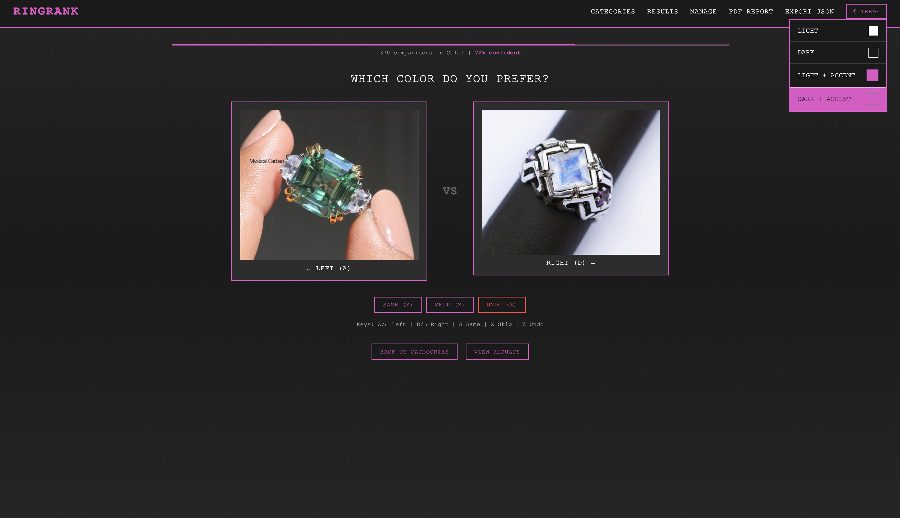
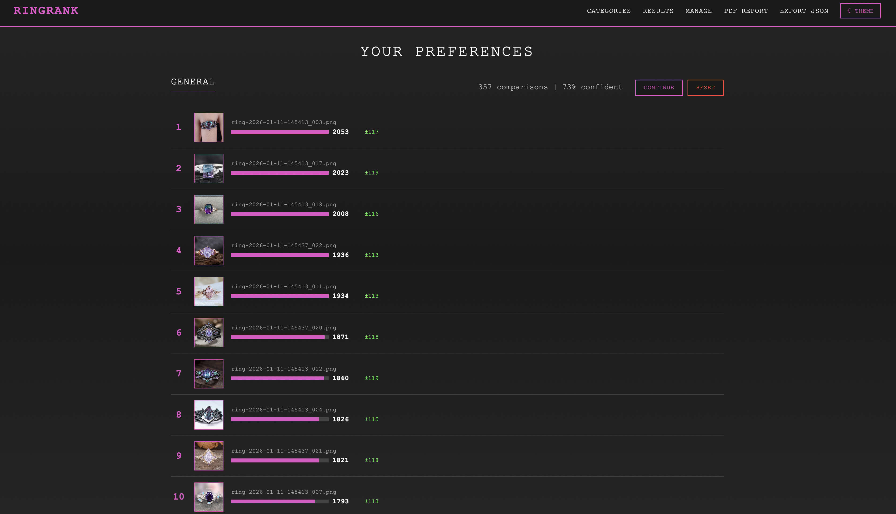
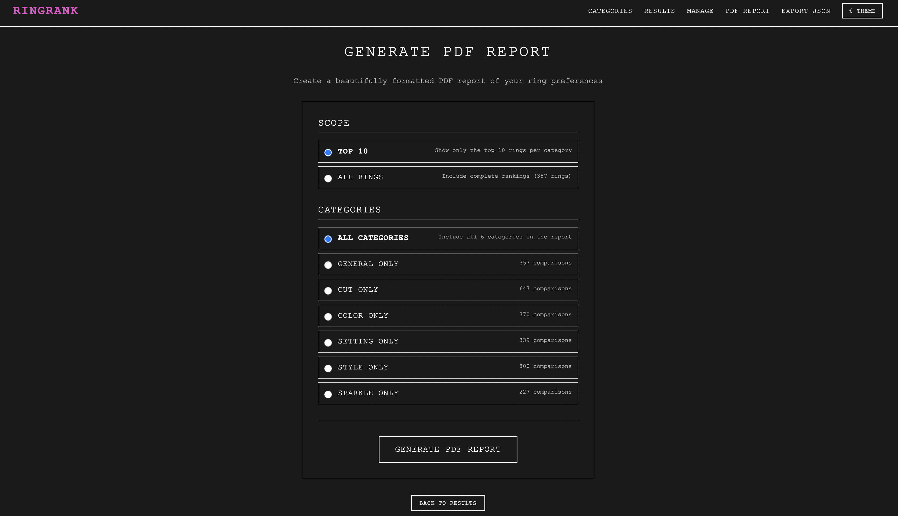
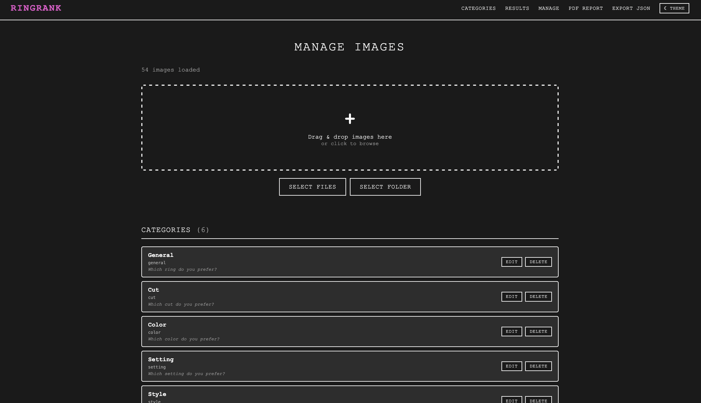

# RingRank

[](https://opensource.org/licenses/MIT)
[](https://golang.org/)
[](https://htmx.org/)

A "Hot or Not" style comparison tool for figuring out what you like in a ring. I needed something quick without having to make an account or pay a subscription.

<!-- SCREENSHOT: Main voting interface -->



## Features

- **Smart Comparisons** - Glicko-2 rating algorithm prioritizes the most informative matchups, reducing comparisons by ~50%
- **Multiple Categories** - Rate rings by general preference, cut, color, setting, style, or custom categories
- **Real-time Confidence** - See how confident the system is in your rankings as you vote
- **Keyboard Shortcuts** - Quick voting with A/D keys, skip, undo, and mark as "same"
- **Image Management** - Drag & drop upload, folder upload, and easy deletion
- **Category Management** - Add, edit, or remove custom categories
- **PDF Reports** - Generate beautiful reports with cross-category performance summaries
- **Dark/Light Themes** - Multiple themes with customizable accent colors
- **Export Data** - Export all rankings and comparisons as JSON
- **No Database Required** - All data stored in simple JSON files

## Quick Start

### Docker (Recommended)

The easiest way to run RingRank is with Docker:

```bash
# Clone the repository
git clone https://github.com/YOUR_USERNAME/ringrank.git
cd ringrank

# Run with Docker Compose
docker compose up -d
```

Open http://localhost:8089 in your browser. Your images go in the `rings/` folder and data persists in `data/`.

To stop:

```bash
docker compose down
```

### Alternative: Download Binary

Download the latest release for your platform from the [Releases](https://github.com/K8sKween/ringrank/releases) page.

### Alternative: Build from Source

```bash
# Clone the repository
git clone https://github.com/K8sKween/ringrank.git
cd ringrank

# Build
go build -o ringrank main.go

# Run
./ringrank
```

### Usage

1. **Start the server**

   ```bash
   ./ringrank
   ```

   Open http://localhost:8089 in your browser

2. **Add your images**

   - Go to **Manage** in the navigation
   - Drag & drop images, or use the folder/file upload buttons
   - Supports PNG, JPG, GIF, and WebP

3. **Start comparing**

   - Click a category to begin
   - Use your mouse or keyboard to vote:
     - `A` or `Left Arrow` - Choose left ring
     - `D` or `Right Arrow` - Choose right ring
     - `S` - Mark as same/equal
     - `X` - Skip this comparison
     - `Z` - Undo last vote

4. **View results**

   - See rankings update in real-time
   - Confidence indicators show how settled the rankings are
   - Expand any category to see full rankings

5. **Generate a report**
   - Click **PDF Report** to customize and download
   - Choose top 10 or all rings
   - Select specific categories or all
   - Cross-category summary shows overall performance

<!-- SCREENSHOT: Results page -->



## How It Works

RingRank uses the **Glicko-2 rating system**, an improvement over ELO that tracks:

- **Rating** - How highly ranked each ring is
- **Rating Deviation (RD)** - How uncertain we are about the rating
- **Volatility** - How consistent the ring's performance is

The system intelligently selects matchups between:

- Rings with high uncertainty (need more data)
- Rings with similar ratings (close matchups are most informative)

This means you get accurate rankings faster than random pairwise comparisons.

## Configuration

The server runs on port 8089 by default. Images are stored in the `rings/` directory and data in `data/results.json`.

### Directory Structure

```
ringrank/
├── main.go           # Server code
├── rings/            # Your images go here
├── data/
│   └── results.json  # Rankings and comparison history
├── templates/        # HTML templates
├── static/           # CSS styles
└── README.md
```

## Requirements

### Docker (Recommended)

Just [Docker](https://docs.docker.com/get-docker/) - everything else is included in the container.

### Manual Installation

- **Go 1.21+** (for building from source)
- **Typst** (optional, for PDF report generation)

  ```bash
  # macOS
  brew install typst

  # Linux
  cargo install typst-cli

  # Windows
  winget install typst
  ```

## Screenshots

<!-- Add your screenshots here -->

| Voting                            | Results                             | Report                            |
| --------------------------------- | ----------------------------------- | --------------------------------- |
|  |  |  |

| Image Management                  | Theme Options                     |
| --------------------------------- | --------------------------------- |
|  |  |

## Contributing

Contributions are welcome! Please feel free to submit a Pull Request.

1. Fork the repository
2. Create your feature branch (`git checkout -b feature/amazing-feature`)
3. Commit your changes (`git commit -m 'Add amazing feature'`)
4. Push to the branch (`git push origin feature/amazing-feature`)
5. Open a Pull Request

## License

This project is licensed under the MIT License - see the [LICENSE](LICENSE) file for details.

## Acknowledgments

- [HTMX](https://htmx.org/) for simple, powerful frontend interactivity
- [Glicko-2](http://www.glicko.net/glicko/glicko2.pdf) rating system by Mark Glickman
- [Typst](https://typst.app/) for beautiful PDF generation
